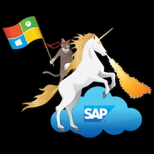

###  SAP Deployment Automation Framework <!-- omit in toc -->
 

# Welcome <!-- omit in toc -->

Master Branch's status: 

  

## Abstract <!-- omit in toc -->

---
 

Welcome to the **SAP on Azure Deployment Automation Framework** repository.
This repository contains code that will support the automated deployments of SAP platforms in the Azure Cloud.
 

Please follow the linke below to the documentation:
  

## [SAP Deployment Automation Framework Documentation](documentation/SAP_Automation_on_Azure/overview.md) <!-- omit in toc -->

   

# Table of contents <!-- omit in toc -->

- [Contributions](#contributions)
- [License & Copyright](#license--copyright)
- [Contact](#contact)

  

---

## Contributions

If you want to contribute to our project, be sure to review the [contributing guidelines](/CONTRIBUTING.md).

We use [GitHub issues](https://github.com/Azure/sap-hana/issues/) for feature requests and bugs.

 

## License & Copyright

Copyright © 2018-2020 Microsoft Azure.

Licensed under the [MIT License](LICENSE).

 

## Contact

We look forward to your feedback and welcome any contributions!

Please feel free to reach out to our team at .
