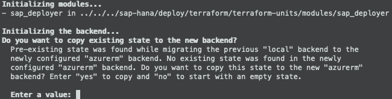

###  SAP Automation > V1.x.x <!-- omit in toc -->
# Bootstrap - Reinitialization <!-- omit in toc -->

Master Branch's status: [](https://dev.azure.com/azuresaphana/Azure-SAP-HANA/_build/latest?definitionId=6&branchName=master)

<br>

## Table of contents <!-- omit in toc -->

- [Overview](#overview)
- [Procedure](#procedure)
  - [Deployer](#deployer)
  - [SAP Library](#sap-library)

<br>

## Overview

|                  |              |
| ---------------- | ------------ |
| Duration of Task | `3 minutes`  |
| Steps            | `5`          |
| Runtime          | `1 minutes`  |

---

<br/><br/>

## Procedure

### Deployer

<br/>

1. Change to Working Directory.
    ```bash
    cd ~/Azure_SAP_Automated_Deployment/WORKSPACES/LOCAL/NP-EUS2-DEP00-INFRASTRUCTURE
    ```

<br/>

2. Create *backend* parameter file.
    ```bash
    cat <<EOF > backend
    resource_group_name   = "NP-EUS2-SAP_LIBRARY"
    storage_account_name  = "<tfstate_storage_account_name>"
    container_name        = "tfstate"
    key                   = "NP-EUS2-DEP00-INFRASTRUCTURE.terraform.tfstate"
    EOF
    ```

<br>

3. Terraform
    1. Initialization
       ```bash
       terraform init  --backend-config backend                                        \
                       ../../../sap-hana/deploy/terraform/run/sap_deployer/
       ```
       
       Respond ***yes*** to the following:
       <br/><br/>

       ...And remove the local State File.

       ```bash
       rm terraform.tfstate*
       ```

    2. Plan
       ```bash
       terraform plan  --var-file=NP-EUS2-DEP00-INFRASTRUCTURE.json                    \
                       ../../../sap-hana/deploy/terraform/run/sap_deployer/
       ```

    3. Apply
       <br/>
       ```bash
       terraform apply --auto-approve                                                  \
                       --var-file=NP-EUS2-DEP00-INFRASTRUCTURE.json                    \
                       ../../../sap-hana/deploy/terraform/run/sap_deployer/
       ```

<br/><br/>

---

<br/><br/>

### SAP Library

<br/>

1. Change to Working Directory.
    ```bash
    cd ~/Azure_SAP_Automated_Deployment/WORKSPACES/SAP_LIBRARY/NP-EUS2-SAP_LIBRARY
    ```

<br/>

2. Create *backend* parameter file.
    ```bash
    cat <<EOF > backend
    resource_group_name   = "NP-EUS2-SAP_LIBRARY"
    storage_account_name  = "<tfstate_storage_account_name>"
    container_name        = "tfstate"
    key                   = "NP-EUS2-SAP_LIBRARY.terraform.tfstate"
    EOF
    ```

<br/>

3. Add Key/Pair `tfstate_resource_id` to the input JSON

    ```
    {
        "tfstate_resource_id": "/subscriptions/<subscription_id>/resourceGroups/<Resource_Group_name>/providers/Microsoft.Storage/storageAccounts/<tfstate_storge_account_name>",
        "infrastructure": {
            ...
    }
    ```

4. Terraform
    1. Initialization
       ```bash
       terraform init  --backend-config backend                                        \
                       ../../../sap-hana/deploy/terraform/run/sap_library/
       ```
       
       Respond ***yes*** to the following:
       <br/><br/>

       ...And remove the local State File.

       ```bash
       rm terraform.tfstate*
       ```

    2. Plan
       ```bash
       terraform plan  --var-file=NP-EUS2-SAP_LIBRARY.json                             \
                       ../../../sap-hana/deploy/terraform/run/sap_library/
       ```

    3. Apply
       <br/>
       ```bash
       terraform apply --auto-approve                                                  \
                       --var-file=NP-EUS2-SAP_LIBRARY.json                             \
                       ../../../sap-hana/deploy/terraform/run/sap_library/
       ```

<br/><br/><br/><br/>

# Next: [SAP Workload VNET](05-workload-vnet.md) <!-- omit in toc -->
