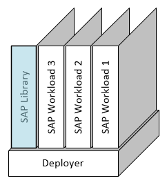

###  SAP Automation > V1.x.x <!-- omit in toc -->
# Bootstrap - SAP Library <!-- omit in toc -->

Master Branch's status: [](https://dev.azure.com/azuresaphana/Azure-SAP-HANA/_build/latest?definitionId=6&branchName=master)

<br/>

## Table of contents <!-- omit in toc -->

- [Overview](#overview)
- [Procedure](#procedure)

<br/>

## Overview


|                  |              |
| ---------------- | ------------ |
| Duration of Task | `5 minutes`  |
| Steps            | `5`          |
| Runtime          | `1 minutes`  |

---

<br/><br/>

## Procedure

<br/>

1. Repository

    1. Checkout Branch
        ```bash
        cd  ~/Azure_SAP_Automated_Deployment/sap-hana
        git checkout beta/v1.0
        ```

    2. Verify Branch is at expected Revision: `58676615fcf5678a187d599629a9c7c6b121a966`
        ```bash
        git rev-parse HEAD
        ```

<br/>

2. Create Working Directory.
    ```bash
    mkdir -p ~/Azure_SAP_Automated_Deployment/WORKSPACES/SAP_LIBRARY/NP-EUS2-SAP_LIBRARY; cd $_
    ```

<br/>

3. Create input parameter [JSON](templates/NP-EUS2-SAP_LIBRARY.json)
    ```bash
    vi NP-EUS2-SAP_LIBRARY.json
    ```

<br/>

4. Terraform
    1. Initialization
       ```bash
       terraform init  ../../../sap-hana/deploy/terraform/bootstrap/sap_library/
       ```

    2. Plan
       ```bash
       terraform plan                                                                  \
                       --var-file=NP-EUS2-SAP_LIBRARY.json                             \
                       ../../../sap-hana/deploy/terraform/bootstrap/sap_library
       ```

    3. Apply
       <br/>
       *This step deploys the resources*
       ```bash
       terraform apply --auto-approve                                                  \
                       --var-file=NP-EUS2-SAP_LIBRARY.json                             \
                       ../../../sap-hana/deploy/terraform/bootstrap/sap_library/
       ```

<br/>

5. Extract Storage Account name
   ```bash
   egrep -wi 'storage_account_name' terraform.tfstate | sed -e 's/^[ \t]*//' | grep -m 1 -i tfstate
   ```

<br/><br/><br/><br/>

# Next: [Reinitialize](03-reinitialize.md) <!-- omit in toc -->
