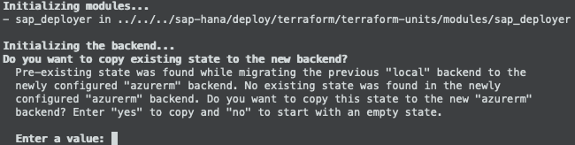

###  SAP Automation > V1.x.x <!-- omit in toc -->
# Bootstrap - Reinitialization <!-- omit in toc -->

Master Branch's status: [](https://dev.azure.com/azuresaphana/Azure-SAP-HANA/_build/latest?definitionId=6&branchName=master)

<br/>

## Table of contents <!-- omit in toc -->

- [Overview](#overview)
- [Procedure](#procedure)
  - [SAP Library](#sap-library)
  - [Deployer](#deployer)

<br/>

## Overview

|                  |              |
| ---------------- | ------------ |
| Duration of Task | `3 minutes`  |
| Steps            | `5`          |
| Runtime          | `1 minutes`  |

---

<br/><br/>

## Procedure

### SAP Library

<br/>

1. Change to Working Directory.
    ```bash
    cd ~/Azure_SAP_Automated_Deployment/WORKSPACES/SAP_LIBRARY/NP-EUS2-SAP_LIBRARY
    ```

<br/>

2. Extract Storage Account name
   ```bash
   egrep -wi 'storage_account_name' terraform.tfstate | sed -e 's/^[ \t]*//' | grep -m 1 -i tfstate
   ```

<br/>

3. Create *backend* parameter file.
   <br/>Update with Storage Account name for TFSTATE, identified in previous step.
    ```bash
    cat <<EOF > backend
    resource_group_name   = "NP-EUS2-SAP_LIBRARY"
    storage_account_name  = "REPLACE_WITH_TFSTATE_STORAGE_ACCOUNT_NAME"
    container_name        = "tfstate"
    key                   = "NP-EUS2-SAP_LIBRARY.terraform.tfstate"
    EOF
    ```

<br/>

4. Terraform
    1. Initialization
       ```bash
       terraform init  --backend-config backend                                        \
                       ../../../sap-hana/deploy/terraform/run/sap_library/
       ```
       
       Respond ***yes*** to the following:
       <br/><br/>

       ...And remove the local State File.

       ```bash
       rm terraform.tfstate*
       ```

    2. Plan
       ```bash
       terraform plan  --var-file=NP-EUS2-SAP_LIBRARY.json                             \
                       ../../../sap-hana/deploy/terraform/run/sap_library/
       ```

    3. Apply
       <br/>
       ```bash
       terraform apply --auto-approve                                                  \
                       --var-file=NP-EUS2-SAP_LIBRARY.json                             \
                       ../../../sap-hana/deploy/terraform/run/sap_library/
       ```

<br/><br/>

---

<br/><br/>

### Deployer

<br/>

6. Change to Working Directory.
    ```bash
    cd ~/Azure_SAP_Automated_Deployment/WORKSPACES/LOCAL/NP-EUS2-DEP00-INFRASTRUCTURE
    ```

<br/>

7. Extract Storage Account name
   ```bash
   egrep -wi 'storage_account_name'                                                    \
     ../../SAP_LIBRARY/NP-EUS2-SAP_LIBRARY/.terraform/terraform.tfstate |              \
     sed -e 's/^[ \t]*//' | grep -m 1 -i tfstate
   ```

<br/>

8. Create *backend* parameter file.
   <br/>Update with Storage Account name for TFSTATE, identified in previous step.
    ```bash
    cat <<EOF > backend
    resource_group_name   = "NP-EUS2-SAP_LIBRARY"
    storage_account_name  = "REPLACE_WITH_TFSTATE_STORAGE_ACCOUNT_NAME"
    container_name        = "tfstate"
    key                   = "NP-EUS2-DEP00-INFRASTRUCTURE.terraform.tfstate"
    EOF
    ```

<br/>

9. Terraform
    1. Initialization
       ```bash
       terraform init  --backend-config backend                                        \
                       ../../../sap-hana/deploy/terraform/run/sap_deployer/
       ```
       
       Respond ***yes*** to the following:
       <br/><br/>

       ...And remove the local State File.

       ```bash
       rm terraform.tfstate*
       ```

    2. Plan
       ```bash
       terraform plan  --var-file=NP-EUS2-DEP00-INFRASTRUCTURE.json                    \
                       ../../../sap-hana/deploy/terraform/run/sap_deployer/
       ```

    3. Apply
       <br/>
       ```bash
       terraform apply --auto-approve                                                  \
                       --var-file=NP-EUS2-DEP00-INFRASTRUCTURE.json                    \
                       ../../../sap-hana/deploy/terraform/run/sap_deployer/
       ```

<br/>


<br/><br/><br/><br/>

# Next: [SAP Workload VNET](04-workload-vnet.md) <!-- omit in toc -->
