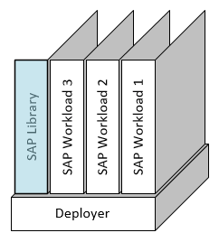
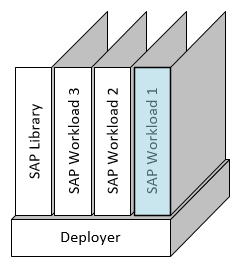

###  SAP Automation > V1.x.x <!-- omit in toc -->
# SDU - SAP Deployment Unit <!-- omit in toc -->

Master Branch's status: 

 

## Table of contents <!-- omit in toc -->

- [Steps](#steps)
- [Overview](#overview)
- [Close Up](#close-up)
- [Deployer](#deployer)
- [SAP Library](#sap-library)
- [SAP Workload VNET](#sap-workload-vnet)
- [SDU](#sdu)

  

## Steps
1. [Bootstrap - Deployer](01-bootstrap-deployer.md)
2. [Bootstrap - SAP Library](02-bootstrap-library.md)
3. [Bootstrap - Reinitialize](03-reinitialize.md)
4. [Deploy SAP Workload VNET](04-workload-vnet.md)
5. [Deploy SDU](05-sdu.md)

 

---

 

## Overview

Environment
- Subscription
- Deployer
- SAP Library (1 or more regionally distributed)
- SAP Workload VNET (Harbor - Global and/or Logical Partitioning within region)
- SDU - SAP Deployment Unit (Deploys into SAP Workload VNET)

## Close Up

## Deployer

## SAP Library

## SAP Workload VNET

## SDU

    

# Next: [SAP Deployment Unit - SDU](01-bootstrap-deployer.md) <!-- omit in toc -->
